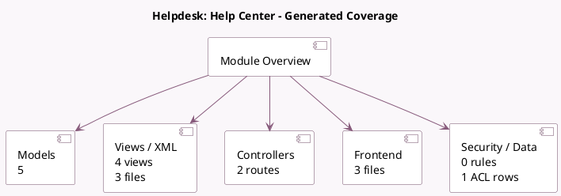

<!-- GENERATED:MODULE -->
---
tags: [odoo, enterprise, module]
---

# Helpdesk: Help Center

- Scope: Enterprise Addons
- Source: enterprise/website_helpdesk_forum
- Dependencies: [[docs/Community Addons/website_forum/website_forum|website_forum]], [[docs/Enterprise Addons/website_helpdesk/website_helpdesk|website_helpdesk]]

## Summary

Help Center for helpdesk based on Odoo Forum

## Generated coverage

- Models: 5
- XML files with UI/data artifacts: 3
- Views: 4
- Actions: 1
- Menus: 0
- Rules (ir.rule): 0
- Access CSV entries: 1
- Controller units: 1
- Frontend asset files: 3

## Module map

## Detail notes

- Models: [[docs/Enterprise Addons/website_helpdesk_forum/Models|Models]] (5)
- Views and XML: [[docs/Enterprise Addons/website_helpdesk_forum/Views|Views]] (3 files)
- Controllers: [[docs/Enterprise Addons/website_helpdesk_forum/Controllers|Controllers]] (1)
- Frontend: [[docs/Enterprise Addons/website_helpdesk_forum/Frontend|Frontend]] (3 files)

## Key models

- `forum.forum`
- `forum.post`
- `helpdesk.team`
- `helpdesk.ticket`
- `helpdesk.ticket.select.forum.wizard`

## Navigation

- [[../Enterprise Addons/Enterprise Addons|Back to scope]]
- [[../../docs/docs|Back to docs]]

<!-- GENERATED:MODULE -->

