<!-- GENERATED:MODEL -->
---
tags: [odoo, enterprise, generated, model]
---

# helpdesk.team

- Module: [[docs/Enterprise Addons/website_helpdesk_knowledge/website_helpdesk_knowledge|website_helpdesk_knowledge]]
- Scope: Enterprise Addons
- Defined in module: extension only
- Source files: `models/helpdesk.py`
- Python classes: `HelpdeskTeam`

## Field footprint

- Detected fields: 3
- Field types: `Boolean` x 1, `Many2many` x 1, `Many2one` x 1
- Relation fields: 2

## Sample fields

- `show_knowledge_base_article`: `Boolean` (compute `_compute_show_knowledge_base_article`)
- `website_article_id`: `Many2one` (comodel `knowledge.article`)
- `website_latest_articles`: `Many2many` (comodel `knowledge.article`, compute `_compute_latest_articles`)

## Method hints

- Detected methods: 4
- Action methods: none
- Compute methods: `_compute_latest_articles`, `_compute_show_knowledge_base_article`
- Onchange methods: none

## Direct relation diagram

```plantuml
@startuml
!define ODOO_COLOR_PRIMARY #714B67
!define ODOO_COLOR_ACCENT #875A7B
!define ODOO_COLOR_BG #FAF7FA

skinparam backgroundColor ODOO_COLOR_BG
skinparam defaultTextAlignment left
skinparam ArrowColor ODOO_COLOR_ACCENT
skinparam ClassBackgroundColor white
skinparam ClassBorderColor ODOO_COLOR_PRIMARY
skinparam ComponentBackgroundColor white
skinparam ComponentBorderColor ODOO_COLOR_PRIMARY
skinparam NoteBackgroundColor #FFF8FF
skinparam NoteBorderColor ODOO_COLOR_ACCENT
skinparam SequenceLifeLineBorderColor ODOO_COLOR_ACCENT
skinparam SequenceLifeLineBackgroundColor #FFFFFF
skinparam SequenceParticipantBorderColor ODOO_COLOR_PRIMARY
skinparam SequenceParticipantBackgroundColor #FFFFFF
skinparam sequence {
  ArrowColor ODOO_COLOR_ACCENT
  ActorBorderColor ODOO_COLOR_PRIMARY
}
title helpdesk.team - Direct Relations
class "helpdesk.team" as helpdesk_team
class "knowledge.article" as knowledge_article
helpdesk_team --> knowledge_article : website_article_id
helpdesk_team .. knowledge_article : website_latest_articles
@enduml
```

## Navigation

- **Parent:** [[docs/Enterprise Addons/website_helpdesk_knowledge/Models]]

<!-- GENERATED:MODEL -->
