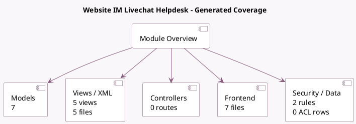

<!-- GENERATED:MODULE -->
---
tags: [odoo, enterprise, module]
---

# Website IM Livechat Helpdesk

- Scope: Enterprise Addons
- Source: enterprise/website_helpdesk_livechat
- Dependencies: [[docs/Enterprise Addons/website_helpdesk/website_helpdesk|website_helpdesk]], [[docs/Community Addons/website_livechat/website_livechat|website_livechat]]

## Summary

Ticketing, Support, Livechat

## Generated coverage

- Models: 7
- XML files with UI/data artifacts: 5
- Views: 5
- Actions: 0
- Menus: 1
- Rules (ir.rule): 2
- Access CSV entries: 0
- Controller units: 0
- Frontend asset files: 7

## Module map

## Detail notes

- Models: [[docs/Enterprise Addons/website_helpdesk_livechat/Models|Models]] (7)
- Views and XML: [[docs/Enterprise Addons/website_helpdesk_livechat/Views|Views]] (5 files)
- Frontend: [[docs/Enterprise Addons/website_helpdesk_livechat/Frontend|Frontend]] (7 files)

## Key models

- `chatbot.script`
- `chatbot.script.step`
- `discuss.channel`
- `helpdesk.team`
- `helpdesk.ticket`
- `im_livechat.report.channel`
- `res.users`

## Navigation

- [[../Enterprise Addons/Enterprise Addons|Back to scope]]
- [[../../docs/docs|Back to docs]]

<!-- GENERATED:MODULE -->

