<!-- GENERATED:MODEL -->
---
tags: [odoo, enterprise, generated, model]
---

# helpdesk.team

- Module: [[docs/Enterprise Addons/website_helpdesk_slides/website_helpdesk_slides|website_helpdesk_slides]]
- Scope: Enterprise Addons
- Defined in module: extension only
- Source files: `models/helpdesk.py`
- Python classes: `HelpdeskTeam`

## Field footprint

- Detected fields: 3
- Field types: `Boolean` x 1, `Many2many` x 2
- Relation fields: 2

## Sample fields

- `show_knowledge_base_slide_channel`: `Boolean` (compute `_compute_show_knowledge_base_slide_channel`)
- `website_slide_channel_ids`: `Many2many` (comodel `slide.channel`)
- `website_top_channels`: `Many2many` (comodel `slide.channel`, compute `_compute_website_top_channels`)

## Method hints

- Detected methods: 5
- Action methods: none
- Compute methods: `_compute_show_knowledge_base_slide_channel`, `_compute_website_top_channels`
- Onchange methods: none

## Direct relation diagram

```plantuml
@startuml
!define ODOO_COLOR_PRIMARY #714B67
!define ODOO_COLOR_ACCENT #875A7B
!define ODOO_COLOR_BG #FAF7FA

skinparam backgroundColor ODOO_COLOR_BG
skinparam defaultTextAlignment left
skinparam ArrowColor ODOO_COLOR_ACCENT
skinparam ClassBackgroundColor white
skinparam ClassBorderColor ODOO_COLOR_PRIMARY
skinparam ComponentBackgroundColor white
skinparam ComponentBorderColor ODOO_COLOR_PRIMARY
skinparam NoteBackgroundColor #FFF8FF
skinparam NoteBorderColor ODOO_COLOR_ACCENT
skinparam SequenceLifeLineBorderColor ODOO_COLOR_ACCENT
skinparam SequenceLifeLineBackgroundColor #FFFFFF
skinparam SequenceParticipantBorderColor ODOO_COLOR_PRIMARY
skinparam SequenceParticipantBackgroundColor #FFFFFF
skinparam sequence {
  ArrowColor ODOO_COLOR_ACCENT
  ActorBorderColor ODOO_COLOR_PRIMARY
}
title helpdesk.team - Direct Relations
class "helpdesk.team" as helpdesk_team
class "slide.channel" as slide_channel
helpdesk_team .. slide_channel : website_slide_channel_ids
helpdesk_team .. slide_channel : website_top_channels
@enduml
```

## Navigation

- **Parent:** [[docs/Enterprise Addons/website_helpdesk_slides/Models]]

<!-- GENERATED:MODEL -->
