<!-- GENERATED:MODEL -->
---
tags: [odoo, enterprise, generated, model]
---

# slide.channel

- Module: [[docs/Enterprise Addons/website_helpdesk_slides/website_helpdesk_slides|website_helpdesk_slides]]
- Scope: Enterprise Addons
- Defined in module: extension only
- Source files: `models/slide_channel.py`
- Python classes: `SlideChannel`

## Field footprint

- Detected fields: 2
- Field types: `Integer` x 1, `Many2many` x 1
- Relation fields: 1

## Sample fields

- `helpdesk_team_count`: `Integer` (comodel `Helpdesk Team Count`, compute `_compute_helpdesk_team_count`)
- `helpdesk_team_ids`: `Many2many` (comodel `helpdesk.team`)

## Method hints

- Detected methods: 3
- Action methods: `action_view_helpdesk_teams`
- Compute methods: `_compute_helpdesk_team_count`
- Onchange methods: none

## Direct relation diagram

```plantuml
@startuml
!define ODOO_COLOR_PRIMARY #714B67
!define ODOO_COLOR_ACCENT #875A7B
!define ODOO_COLOR_BG #FAF7FA

skinparam backgroundColor ODOO_COLOR_BG
skinparam defaultTextAlignment left
skinparam ArrowColor ODOO_COLOR_ACCENT
skinparam ClassBackgroundColor white
skinparam ClassBorderColor ODOO_COLOR_PRIMARY
skinparam ComponentBackgroundColor white
skinparam ComponentBorderColor ODOO_COLOR_PRIMARY
skinparam NoteBackgroundColor #FFF8FF
skinparam NoteBorderColor ODOO_COLOR_ACCENT
skinparam SequenceLifeLineBorderColor ODOO_COLOR_ACCENT
skinparam SequenceLifeLineBackgroundColor #FFFFFF
skinparam SequenceParticipantBorderColor ODOO_COLOR_PRIMARY
skinparam SequenceParticipantBackgroundColor #FFFFFF
skinparam sequence {
  ArrowColor ODOO_COLOR_ACCENT
  ActorBorderColor ODOO_COLOR_PRIMARY
}
title slide.channel - Direct Relations
class "slide.channel" as slide_channel
class "helpdesk.team" as helpdesk_team
slide_channel .. helpdesk_team : helpdesk_team_ids
@enduml
```

## Navigation

- **Parent:** [[docs/Enterprise Addons/website_helpdesk_slides/Models]]

<!-- GENERATED:MODEL -->
