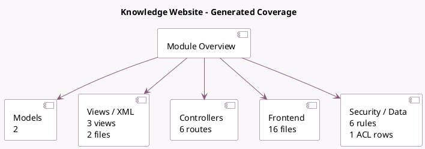

<!-- GENERATED:MODULE -->
---
tags: [odoo, enterprise, module]
---

# Knowledge Website

- Scope: Enterprise Addons
- Source: enterprise/website_knowledge
- Dependencies: [[docs/Enterprise Addons/knowledge/knowledge|knowledge]], [[docs/Community Addons/website/website|website]]

## Summary

Publish your articles

## Generated coverage

- Models: 2
- XML files with UI/data artifacts: 2
- Views: 3
- Actions: 2
- Menus: 0
- Rules (ir.rule): 6
- Access CSV entries: 1
- Controller units: 1
- Frontend asset files: 16

## Module map

## Detail notes

- Models: [[docs/Enterprise Addons/website_knowledge/Models|Models]] (2)
- Views and XML: [[docs/Enterprise Addons/website_knowledge/Views|Views]] (2 files)
- Controllers: [[docs/Enterprise Addons/website_knowledge/Controllers|Controllers]] (1)
- Frontend: [[docs/Enterprise Addons/website_knowledge/Frontend|Frontend]] (16 files)

## Key models

- `knowledge.article`
- `website`

## Navigation

- [[../Enterprise Addons/Enterprise Addons|Back to scope]]
- [[../../docs/docs|Back to docs]]

<!-- GENERATED:MODULE -->

