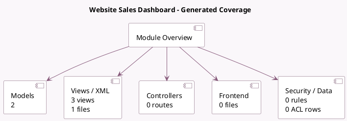

<!-- GENERATED:MODULE -->
---
tags: [odoo, enterprise, module]
---

# Website Sales Dashboard

- Scope: Enterprise Addons
- Source: enterprise/website_sale_dashboard
- Dependencies: [[docs/Community Addons/website_sale/website_sale|website_sale]]

## Summary

Get a new dashboard view in the Website App

## Generated coverage

- Models: 2
- XML files with UI/data artifacts: 1
- Views: 3
- Actions: 3
- Menus: 1
- Rules (ir.rule): 0
- Access CSV entries: 0
- Controller units: 0
- Frontend asset files: 0

## Module map

## Detail notes

- Models: [[docs/Enterprise Addons/website_sale_dashboard/Models|Models]] (2)
- Views and XML: [[docs/Enterprise Addons/website_sale_dashboard/Views|Views]] (1 files)

## Key models

- `digest.digest`
- `website`

## Navigation

- [[../Enterprise Addons/Enterprise Addons|Back to scope]]
- [[../../docs/docs|Back to docs]]

<!-- GENERATED:MODULE -->

