<!-- GENERATED:MODEL -->
---
tags: [odoo, enterprise, generated, model]
---

# delivery.carrier

- Module: [[docs/Enterprise Addons/website_sale_fedex/website_sale_fedex|website_sale_fedex]]
- Scope: Enterprise Addons
- Defined in module: extension only
- Source files: `models/delivery_fedex.py`
- Python classes: `DeliveryCarrier`

## Field footprint

- Detected fields: 4
- Field types: `Boolean` x 1, `Char` x 1, `Integer` x 1, `Many2one` x 1
- Relation fields: 1

## Sample fields

- `fedex_locations_radius_unit`: `Many2one` (comodel `uom.uom`, compute `_compute_fedex_locations_radius_unit`, store `True`)
- `fedex_locations_radius_unit_name`: `Char` (comodel `Fedex Radius Unit Name`, related `fedex_locations_radius_unit.display_name`)
- `fedex_locations_radius_value`: `Integer`
- `fedex_use_locations`: `Boolean`

## Method hints

- Detected methods: 6
- Action methods: none
- Compute methods: `_compute_fedex_locations_radius_unit`
- Onchange methods: none

## Direct relation diagram

```plantuml
@startuml
!define ODOO_COLOR_PRIMARY #714B67
!define ODOO_COLOR_ACCENT #875A7B
!define ODOO_COLOR_BG #FAF7FA

skinparam backgroundColor ODOO_COLOR_BG
skinparam defaultTextAlignment left
skinparam ArrowColor ODOO_COLOR_ACCENT
skinparam ClassBackgroundColor white
skinparam ClassBorderColor ODOO_COLOR_PRIMARY
skinparam ComponentBackgroundColor white
skinparam ComponentBorderColor ODOO_COLOR_PRIMARY
skinparam NoteBackgroundColor #FFF8FF
skinparam NoteBorderColor ODOO_COLOR_ACCENT
skinparam SequenceLifeLineBorderColor ODOO_COLOR_ACCENT
skinparam SequenceLifeLineBackgroundColor #FFFFFF
skinparam SequenceParticipantBorderColor ODOO_COLOR_PRIMARY
skinparam SequenceParticipantBackgroundColor #FFFFFF
skinparam sequence {
  ArrowColor ODOO_COLOR_ACCENT
  ActorBorderColor ODOO_COLOR_PRIMARY
}
title delivery.carrier - Direct Relations
class "delivery.carrier" as delivery_carrier
class "uom.uom" as uom_uom
delivery_carrier --> uom_uom : fedex_locations_radius_unit
@enduml
```

## Navigation

- **Parent:** [[docs/Enterprise Addons/website_sale_fedex/Models]]

<!-- GENERATED:MODEL -->
