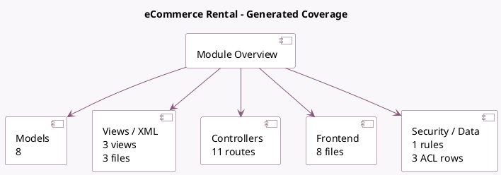

<!-- GENERATED:MODULE -->
---
tags: [odoo, enterprise, module]
---

# eCommerce Rental

- Scope: Enterprise Addons
- Source: enterprise/website_sale_renting
- Dependencies: [[docs/Community Addons/website_sale/website_sale|website_sale]], [[docs/Enterprise Addons/sale_renting/sale_renting|sale_renting]]

## Summary

Sell rental products on your eCommerce

## Generated coverage

- Models: 8
- XML files with UI/data artifacts: 3
- Views: 3
- Actions: 0
- Menus: 0
- Rules (ir.rule): 1
- Access CSV entries: 3
- Controller units: 5
- Frontend asset files: 8

## Module map

## Detail notes

- Models: [[docs/Enterprise Addons/website_sale_renting/Models|Models]] (8)
- Views and XML: [[docs/Enterprise Addons/website_sale_renting/Views|Views]] (3 files)
- Controllers: [[docs/Enterprise Addons/website_sale_renting/Controllers|Controllers]] (5)
- Frontend: [[docs/Enterprise Addons/website_sale_renting/Frontend|Frontend]] (8 files)

## Key models

- `product.pricelist`
- `product.product`
- `product.template`
- `res.company`
- `res.config.settings`
- `sale.order`
- `sale.order.line`
- `website`

## Navigation

- [[../Enterprise Addons/Enterprise Addons|Back to scope]]
- [[../../docs/docs|Back to docs]]

<!-- GENERATED:MODULE -->

