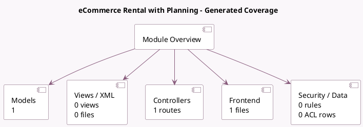

<!-- GENERATED:MODULE -->
---
tags: [odoo, enterprise, module]
---

# eCommerce Rental with Planning

- Scope: Enterprise Addons
- Source: enterprise/website_sale_renting_planning
- Dependencies: [[docs/Enterprise Addons/website_sale_renting/website_sale_renting|website_sale_renting]], [[docs/Enterprise Addons/sale_renting_planning/sale_renting_planning|sale_renting_planning]]

## Summary

Sell rental products on your eCommerce and plan your material resources

## Generated coverage

- Models: 1
- XML files with UI/data artifacts: 0
- Views: 0
- Actions: 0
- Menus: 0
- Rules (ir.rule): 0
- Access CSV entries: 0
- Controller units: 1
- Frontend asset files: 1

## Module map

## Detail notes

- Models: [[docs/Enterprise Addons/website_sale_renting_planning/Models|Models]] (1)
- Controllers: [[docs/Enterprise Addons/website_sale_renting_planning/Controllers|Controllers]] (1)
- Frontend: [[docs/Enterprise Addons/website_sale_renting_planning/Frontend|Frontend]] (1 files)

## Key models

- `product.template`

## Navigation

- [[../Enterprise Addons/Enterprise Addons|Back to scope]]
- [[../../docs/docs|Back to docs]]

<!-- GENERATED:MODULE -->

