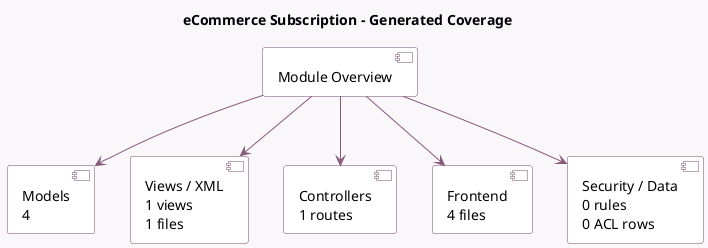

<!-- GENERATED:MODULE -->
---
tags: [odoo, enterprise, module]
---

# eCommerce Subscription

- Scope: Enterprise Addons
- Source: enterprise/website_sale_subscription
- Dependencies: [[docs/Community Addons/website_sale/website_sale|website_sale]], [[docs/Enterprise Addons/sale_subscription/sale_subscription|sale_subscription]]

## Summary

Sell subscription products on your eCommerce

## Generated coverage

- Models: 4
- XML files with UI/data artifacts: 1
- Views: 1
- Actions: 0
- Menus: 0
- Rules (ir.rule): 0
- Access CSV entries: 0
- Controller units: 1
- Frontend asset files: 4

## Module map

## Detail notes

- Models: [[docs/Enterprise Addons/website_sale_subscription/Models|Models]] (4)
- Views and XML: [[docs/Enterprise Addons/website_sale_subscription/Views|Views]] (1 files)
- Controllers: [[docs/Enterprise Addons/website_sale_subscription/Controllers|Controllers]] (1)
- Frontend: [[docs/Enterprise Addons/website_sale_subscription/Frontend|Frontend]] (4 files)

## Key models

- `product.product`
- `product.template`
- `sale.order`
- `sale.order.line`

## Navigation

- [[../Enterprise Addons/Enterprise Addons|Back to scope]]
- [[../../docs/docs|Back to docs]]

<!-- GENERATED:MODULE -->

