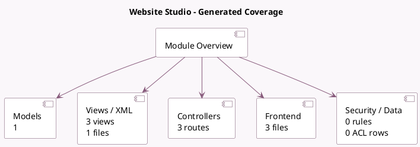

<!-- GENERATED:MODULE -->
---
tags: [odoo, enterprise, module]
---

# Website Studio

- Scope: Enterprise Addons
- Source: enterprise/website_studio
- Dependencies: [[docs/Enterprise Addons/web_studio/web_studio|web_studio]], [[docs/Community Addons/website/website|website]]

## Summary

Display Website Elements in Studio

## Generated coverage

- Models: 1
- XML files with UI/data artifacts: 1
- Views: 3
- Actions: 0
- Menus: 0
- Rules (ir.rule): 0
- Access CSV entries: 0
- Controller units: 1
- Frontend asset files: 3

## Module map

## Detail notes

- Models: [[docs/Enterprise Addons/website_studio/Models|Models]] (1)
- Views and XML: [[docs/Enterprise Addons/website_studio/Views|Views]] (1 files)
- Controllers: [[docs/Enterprise Addons/website_studio/Controllers|Controllers]] (1)
- Frontend: [[docs/Enterprise Addons/website_studio/Frontend|Frontend]] (3 files)

## Key models

- `website.controller.page`

## Navigation

- [[../Enterprise Addons/Enterprise Addons|Back to scope]]
- [[../../docs/docs|Back to docs]]

<!-- GENERATED:MODULE -->

