<!-- GENERATED:MODEL -->
---
tags: [odoo, enterprise, generated, model]
---

# discuss.channel

- Module: [[docs/Enterprise Addons/whatsapp/whatsapp|whatsapp]]
- Scope: Enterprise Addons
- Defined in module: extension only
- Source files: `models/discuss_channel.py`
- Python classes: `DiscussChannel`

## Field footprint

- Detected fields: 7
- Field types: `Boolean` x 1, `Char` x 1, `Datetime` x 1, `Many2one` x 3, `Selection` x 1
- Relation fields: 3

## Sample fields

- `channel_type`: `Selection`
- `last_wa_mail_message_id`: `Many2one` (comodel `mail.message`)
- `wa_account_id`: `Many2one` (comodel `whatsapp.account`)
- `whatsapp_channel_active`: `Boolean` (comodel `Is Whatsapp Channel Active`, compute `_compute_whatsapp_channel_active`)
- `whatsapp_channel_valid_until`: `Datetime` (compute `_compute_whatsapp_channel_valid_until`)
- `whatsapp_number`: `Char`
- `whatsapp_partner_id`: `Many2one` (comodel `res.partner`)

## Method hints

- Detected methods: 14
- Action methods: none
- Compute methods: `_compute_display_name`, `_compute_group_public_id`, `_compute_whatsapp_channel_active`, `_compute_whatsapp_channel_valid_until`
- Onchange methods: none

## Direct relation diagram

```plantuml
@startuml
!define ODOO_COLOR_PRIMARY #714B67
!define ODOO_COLOR_ACCENT #875A7B
!define ODOO_COLOR_BG #FAF7FA

skinparam backgroundColor ODOO_COLOR_BG
skinparam defaultTextAlignment left
skinparam ArrowColor ODOO_COLOR_ACCENT
skinparam ClassBackgroundColor white
skinparam ClassBorderColor ODOO_COLOR_PRIMARY
skinparam ComponentBackgroundColor white
skinparam ComponentBorderColor ODOO_COLOR_PRIMARY
skinparam NoteBackgroundColor #FFF8FF
skinparam NoteBorderColor ODOO_COLOR_ACCENT
skinparam SequenceLifeLineBorderColor ODOO_COLOR_ACCENT
skinparam SequenceLifeLineBackgroundColor #FFFFFF
skinparam SequenceParticipantBorderColor ODOO_COLOR_PRIMARY
skinparam SequenceParticipantBackgroundColor #FFFFFF
skinparam sequence {
  ArrowColor ODOO_COLOR_ACCENT
  ActorBorderColor ODOO_COLOR_PRIMARY
}
title discuss.channel - Direct Relations
class "discuss.channel" as discuss_channel
class "mail.message" as mail_message
class "res.partner" as res_partner
class "whatsapp.account" as whatsapp_account
discuss_channel --> mail_message : last_wa_mail_message_id
discuss_channel --> res_partner : whatsapp_partner_id
discuss_channel --> whatsapp_account : wa_account_id
@enduml
```

## Navigation

- **Parent:** [[docs/Enterprise Addons/whatsapp/Models]]

<!-- GENERATED:MODEL -->
