<!-- GENERATED:MODEL -->
---
tags: [odoo, enterprise, generated, model]
---

# whatsapp.account

- Module: [[docs/Enterprise Addons/whatsapp/whatsapp|whatsapp]]
- Scope: Enterprise Addons
- Defined in module: yes
- Source files: `models/whatsapp_account.py`
- Python classes: `WhatsappAccount`
- Description: WhatsApp Business Account
- Inherits: `mail.thread`

## Field footprint

- Detected fields: 14
- Field types: `Boolean` x 2, `Char` x 9, `Integer` x 1, `Many2many` x 2
- Relation fields: 2

## Sample fields

- `account_uid`: `Char`
- `active`: `Boolean`
- `allowed_company_ids`: `Many2many` (comodel `res.company`)
- `app_secret`: `Char`
- `app_uid`: `Char`
- `callback_url`: `Char` (compute `_compute_callback_url`)
- `debug_logging`: `Boolean`
- `name`: `Char`
- `notify_user_ids`: `Many2many` (comodel `res.users`)
- `phone_number`: `Char`
- `phone_uid`: `Char`
- `templates_count`: `Integer` (compute `_compute_templates_count`)
- `token`: `Char`
- `webhook_verify_token`: `Char` (compute `_compute_verify_token`, store `True`)

## Method hints

- Detected methods: 12
- Action methods: `action_debug`, `action_open_templates`, `action_stop_debug`
- Compute methods: `_compute_callback_url`, `_compute_templates_count`, `_compute_verify_token`
- Onchange methods: none

## Direct relation diagram

```plantuml
@startuml
!define ODOO_COLOR_PRIMARY #714B67
!define ODOO_COLOR_ACCENT #875A7B
!define ODOO_COLOR_BG #FAF7FA

skinparam backgroundColor ODOO_COLOR_BG
skinparam defaultTextAlignment left
skinparam ArrowColor ODOO_COLOR_ACCENT
skinparam ClassBackgroundColor white
skinparam ClassBorderColor ODOO_COLOR_PRIMARY
skinparam ComponentBackgroundColor white
skinparam ComponentBorderColor ODOO_COLOR_PRIMARY
skinparam NoteBackgroundColor #FFF8FF
skinparam NoteBorderColor ODOO_COLOR_ACCENT
skinparam SequenceLifeLineBorderColor ODOO_COLOR_ACCENT
skinparam SequenceLifeLineBackgroundColor #FFFFFF
skinparam SequenceParticipantBorderColor ODOO_COLOR_PRIMARY
skinparam SequenceParticipantBackgroundColor #FFFFFF
skinparam sequence {
  ArrowColor ODOO_COLOR_ACCENT
  ActorBorderColor ODOO_COLOR_PRIMARY
}
title whatsapp.account - Direct Relations
class "whatsapp.account" as whatsapp_account
class "res.company" as res_company
class "res.users" as res_users
whatsapp_account .. res_company : allowed_company_ids
whatsapp_account .. res_users : notify_user_ids
@enduml
```

## Navigation

- **Parent:** [[docs/Enterprise Addons/whatsapp/Models]]

<!-- GENERATED:MODEL -->
