<!-- GENERATED:MODEL -->
---
tags: [odoo, enterprise, generated, model]
---

# whatsapp.composer

- Module: [[docs/Enterprise Addons/whatsapp/whatsapp|whatsapp]]
- Scope: Enterprise Addons
- Defined in module: yes
- Source files: `wizard/whatsapp_composer.py`
- Python classes: `WhatsappComposer`
- Description: Send WhatsApp Wizard

## Field footprint

- Detected fields: 25
- Field types: `Boolean` x 3, `Char` x 16, `Html` x 1, `Integer` x 3, `Many2one` x 2
- Relation fields: 2

## Sample fields

- `attachment_id`: `Many2one` (comodel `ir.attachment`)
- `batch_mode`: `Boolean` (comodel `Is Multiple Records`)
- `button_dynamic_url_1`: `Char` (compute `_compute_button_dynamic_url`, store `True`)
- `button_dynamic_url_2`: `Char` (compute `_compute_button_dynamic_url`, store `True`)
- `free_text_1`: `Char` (compute `_compute_free_text`, store `True`)
- `free_text_10`: `Char` (compute `_compute_free_text`, store `True`)
- `free_text_2`: `Char` (compute `_compute_free_text`, store `True`)
- `free_text_3`: `Char` (compute `_compute_free_text`, store `True`)
- `free_text_4`: `Char` (compute `_compute_free_text`, store `True`)
- `free_text_5`: `Char` (compute `_compute_free_text`, store `True`)
- `free_text_6`: `Char` (compute `_compute_free_text`, store `True`)
- `free_text_7`: `Char` (compute `_compute_free_text`, store `True`)
- `free_text_8`: `Char` (compute `_compute_free_text`, store `True`)
- `free_text_9`: `Char` (compute `_compute_free_text`, store `True`)
- `header_text_1`: `Char` (compute `_compute_free_text`, store `True`)
- `invalid_phone_number_count`: `Integer` (compute `_compute_invalid_phone_number_count`)
- `is_button_dynamic`: `Boolean` (compute `_compute_is_button_dynamic`)
- `is_header_free_text`: `Boolean` (compute `_compute_is_header_free_text`)
- `number_of_free_text`: `Integer` (compute `_compute_number_of_free_text`)
- `number_of_free_text_button`: `Integer` (compute `_compute_number_of_free_text_button`)

## Method hints

- Detected methods: 19
- Action methods: `action_send_whatsapp_template`
- Compute methods: `_compute_button_dynamic_url`, `_compute_free_text`, `_compute_invalid_phone_number_count`, `_compute_is_button_dynamic`, `_compute_is_header_free_text`, `_compute_number`, `_compute_number_of_free_text`, `_compute_number_of_free_text_button`, and 1 more
- Onchange methods: none

## Direct relation diagram

```plantuml
@startuml
!define ODOO_COLOR_PRIMARY #714B67
!define ODOO_COLOR_ACCENT #875A7B
!define ODOO_COLOR_BG #FAF7FA

skinparam backgroundColor ODOO_COLOR_BG
skinparam defaultTextAlignment left
skinparam ArrowColor ODOO_COLOR_ACCENT
skinparam ClassBackgroundColor white
skinparam ClassBorderColor ODOO_COLOR_PRIMARY
skinparam ComponentBackgroundColor white
skinparam ComponentBorderColor ODOO_COLOR_PRIMARY
skinparam NoteBackgroundColor #FFF8FF
skinparam NoteBorderColor ODOO_COLOR_ACCENT
skinparam SequenceLifeLineBorderColor ODOO_COLOR_ACCENT
skinparam SequenceLifeLineBackgroundColor #FFFFFF
skinparam SequenceParticipantBorderColor ODOO_COLOR_PRIMARY
skinparam SequenceParticipantBackgroundColor #FFFFFF
skinparam sequence {
  ArrowColor ODOO_COLOR_ACCENT
  ActorBorderColor ODOO_COLOR_PRIMARY
}
title whatsapp.composer - Direct Relations
class "whatsapp.composer" as whatsapp_composer
class "ir.attachment" as ir_attachment
class "whatsapp.template" as whatsapp_template
whatsapp_composer --> ir_attachment : attachment_id
whatsapp_composer --> whatsapp_template : wa_template_id
@enduml
```

## Navigation

- **Parent:** [[docs/Enterprise Addons/whatsapp/Models]]

<!-- GENERATED:MODEL -->
