<!-- GENERATED:MODEL -->
---
tags: [odoo, enterprise, generated, model]
---

# whatsapp.message

- Module: [[docs/Enterprise Addons/whatsapp/whatsapp|whatsapp]]
- Scope: Enterprise Addons
- Defined in module: yes
- Source files: `models/whatsapp_message.py`
- Python classes: `WhatsappMessage`
- Description: WhatsApp Messages

## Field footprint

- Detected fields: 13
- Field types: `Char` x 4, `Html` x 1, `Json` x 1, `Many2one` x 4, `Selection` x 3
- Relation fields: 4

## Sample fields

- `body`: `Html` (related `mail_message_id.body`)
- `failure_reason`: `Char`
- `failure_type`: `Selection`
- `free_text_json`: `Json`
- `mail_message_id`: `Many2one` (comodel `mail.message`)
- `message_type`: `Selection`
- `mobile_number`: `Char`
- `mobile_number_formatted`: `Char` (compute `_compute_mobile_number_formatted`, store `True`)
- `msg_uid`: `Char`
- `parent_id`: `Many2one` (comodel `whatsapp.message`)
- `state`: `Selection`
- `wa_account_id`: `Many2one` (comodel `whatsapp.account`)
- `wa_template_id`: `Many2one` (comodel `whatsapp.template`)

## Method hints

- Detected methods: 17
- Action methods: none
- Compute methods: `_compute_mobile_number_formatted`
- Onchange methods: none

## Direct relation diagram

```plantuml
@startuml
!define ODOO_COLOR_PRIMARY #714B67
!define ODOO_COLOR_ACCENT #875A7B
!define ODOO_COLOR_BG #FAF7FA

skinparam backgroundColor ODOO_COLOR_BG
skinparam defaultTextAlignment left
skinparam ArrowColor ODOO_COLOR_ACCENT
skinparam ClassBackgroundColor white
skinparam ClassBorderColor ODOO_COLOR_PRIMARY
skinparam ComponentBackgroundColor white
skinparam ComponentBorderColor ODOO_COLOR_PRIMARY
skinparam NoteBackgroundColor #FFF8FF
skinparam NoteBorderColor ODOO_COLOR_ACCENT
skinparam SequenceLifeLineBorderColor ODOO_COLOR_ACCENT
skinparam SequenceLifeLineBackgroundColor #FFFFFF
skinparam SequenceParticipantBorderColor ODOO_COLOR_PRIMARY
skinparam SequenceParticipantBackgroundColor #FFFFFF
skinparam sequence {
  ArrowColor ODOO_COLOR_ACCENT
  ActorBorderColor ODOO_COLOR_PRIMARY
}
title whatsapp.message - Direct Relations
class "whatsapp.message" as whatsapp_message
class "mail.message" as mail_message
class "whatsapp.account" as whatsapp_account
class "whatsapp.message" as whatsapp_message
class "whatsapp.template" as whatsapp_template
whatsapp_message --> whatsapp_template : wa_template_id
whatsapp_message --> whatsapp_account : wa_account_id
whatsapp_message --> whatsapp_message : parent_id
whatsapp_message --> mail_message : mail_message_id
@enduml
```

## Navigation

- **Parent:** [[docs/Enterprise Addons/whatsapp/Models]]

<!-- GENERATED:MODEL -->
