<!-- GENERATED:MODEL -->
---
tags: [odoo, enterprise, generated, model]
---

# whatsapp.preview

- Module: [[docs/Enterprise Addons/whatsapp/whatsapp|whatsapp]]
- Scope: Enterprise Addons
- Defined in module: yes
- Source files: `wizard/whatsapp_preview.py`
- Python classes: `WhatsappPreview`
- Description: Preview template

## Field footprint

- Detected fields: 2
- Field types: `Html` x 1, `Many2one` x 1
- Relation fields: 1

## Sample fields

- `preview_whatsapp`: `Html` (compute `_compute_preview_whatsapp`)
- `wa_template_id`: `Many2one` (comodel `whatsapp.template`)

## Method hints

- Detected methods: 1
- Action methods: none
- Compute methods: `_compute_preview_whatsapp`
- Onchange methods: none

## Direct relation diagram

```plantuml
@startuml
!define ODOO_COLOR_PRIMARY #714B67
!define ODOO_COLOR_ACCENT #875A7B
!define ODOO_COLOR_BG #FAF7FA

skinparam backgroundColor ODOO_COLOR_BG
skinparam defaultTextAlignment left
skinparam ArrowColor ODOO_COLOR_ACCENT
skinparam ClassBackgroundColor white
skinparam ClassBorderColor ODOO_COLOR_PRIMARY
skinparam ComponentBackgroundColor white
skinparam ComponentBorderColor ODOO_COLOR_PRIMARY
skinparam NoteBackgroundColor #FFF8FF
skinparam NoteBorderColor ODOO_COLOR_ACCENT
skinparam SequenceLifeLineBorderColor ODOO_COLOR_ACCENT
skinparam SequenceLifeLineBackgroundColor #FFFFFF
skinparam SequenceParticipantBorderColor ODOO_COLOR_PRIMARY
skinparam SequenceParticipantBackgroundColor #FFFFFF
skinparam sequence {
  ArrowColor ODOO_COLOR_ACCENT
  ActorBorderColor ODOO_COLOR_PRIMARY
}
title whatsapp.preview - Direct Relations
class "whatsapp.preview" as whatsapp_preview
class "whatsapp.template" as whatsapp_template
whatsapp_preview --> whatsapp_template : wa_template_id
@enduml
```

## Navigation

- **Parent:** [[docs/Enterprise Addons/whatsapp/Models]]

<!-- GENERATED:MODEL -->
