<!-- GENERATED:MODEL -->
---
tags: [odoo, enterprise, generated, model]
---

# whatsapp.template.button

- Module: [[docs/Enterprise Addons/whatsapp/whatsapp|whatsapp]]
- Scope: Enterprise Addons
- Defined in module: yes
- Source files: `models/whatsapp_template_button.py`
- Python classes: `WhatsappTemplateButton`
- Description: WhatsApp Template Button

## Field footprint

- Detected fields: 9
- Field types: `Boolean` x 1, `Char` x 3, `Integer` x 1, `Many2one` x 1, `One2many` x 1, `Selection` x 2
- Relation fields: 2

## Sample fields

- `button_type`: `Selection`
- `call_number`: `Char`
- `has_invalid_number`: `Boolean` (compute `_compute_has_invalid_number`)
- `name`: `Char`
- `sequence`: `Integer`
- `url_type`: `Selection`
- `variable_ids`: `One2many` (comodel `whatsapp.template.variable`, compute `_compute_variable_ids`, store `True`)
- `wa_template_id`: `Many2one` (comodel `whatsapp.template`)
- `website_url`: `Char`

## Method hints

- Detected methods: 6
- Action methods: none
- Compute methods: `_compute_has_invalid_number`, `_compute_variable_ids`
- Onchange methods: `_onchange_website_url`

## Direct relation diagram

```plantuml
@startuml
!define ODOO_COLOR_PRIMARY #714B67
!define ODOO_COLOR_ACCENT #875A7B
!define ODOO_COLOR_BG #FAF7FA

skinparam backgroundColor ODOO_COLOR_BG
skinparam defaultTextAlignment left
skinparam ArrowColor ODOO_COLOR_ACCENT
skinparam ClassBackgroundColor white
skinparam ClassBorderColor ODOO_COLOR_PRIMARY
skinparam ComponentBackgroundColor white
skinparam ComponentBorderColor ODOO_COLOR_PRIMARY
skinparam NoteBackgroundColor #FFF8FF
skinparam NoteBorderColor ODOO_COLOR_ACCENT
skinparam SequenceLifeLineBorderColor ODOO_COLOR_ACCENT
skinparam SequenceLifeLineBackgroundColor #FFFFFF
skinparam SequenceParticipantBorderColor ODOO_COLOR_PRIMARY
skinparam SequenceParticipantBackgroundColor #FFFFFF
skinparam sequence {
  ArrowColor ODOO_COLOR_ACCENT
  ActorBorderColor ODOO_COLOR_PRIMARY
}
title whatsapp.template.button - Direct Relations
class "whatsapp.template.button" as whatsapp_template_button
class "whatsapp.template" as whatsapp_template
class "whatsapp.template.variable" as whatsapp_template_variable
whatsapp_template_button --> whatsapp_template : wa_template_id
whatsapp_template_button --|> whatsapp_template_variable : variable_ids
@enduml
```

## Navigation

- **Parent:** [[docs/Enterprise Addons/whatsapp/Models]]

<!-- GENERATED:MODEL -->
