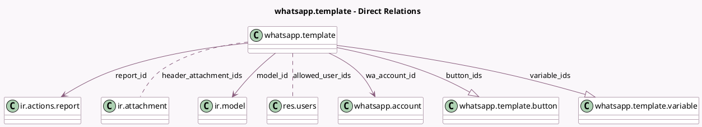

<!-- GENERATED:MODEL -->
---
tags: [odoo, enterprise, generated, model]
---

# whatsapp.template

- Module: [[docs/Enterprise Addons/whatsapp/whatsapp|whatsapp]]
- Scope: Enterprise Addons
- Defined in module: yes
- Source files: `models/whatsapp_template.py`
- Python classes: `WhatsappTemplate`
- Description: WhatsApp Template
- Inherits: `mail.thread`

## Field footprint

- Detected fields: 26
- Field types: `Boolean` x 2, `Char` x 8, `Integer` x 2, `Many2many` x 2, `Many2one` x 3, `One2many` x 2, `Selection` x 5, `Text` x 2
- Relation fields: 7

## Sample fields

- `active`: `Boolean`
- `allowed_user_ids`: `Many2many` (comodel `res.users`)
- `body`: `Text`
- `button_ids`: `One2many` (comodel `whatsapp.template.button`)
- `error_msg`: `Char`
- `footer_text`: `Char`
- `has_action`: `Boolean` (compute `_compute_has_action`)
- `header_attachment_ids`: `Many2many` (comodel `ir.attachment`)
- `header_text`: `Char`
- `header_type`: `Selection`
- `lang_code`: `Selection`
- `messages_count`: `Integer` (compute `_compute_messages_count`)
- `model`: `Char` (related `model_id.model`, store `True`)
- `model_id`: `Many2one` (comodel `ir.model`, store `True`)
- `name`: `Char`
- `phone_field`: `Char` (compute `_compute_phone_field`, store `True`)
- `quality`: `Selection`
- `report_id`: `Many2one` (comodel `ir.actions.report`, compute `_compute_report_id`, store `True`)
- `sequence`: `Integer`
- `status`: `Selection`

## Method hints

- Detected methods: 52
- Action methods: `action_open_messages`
- Compute methods: `_compute_display_name`, `_compute_has_action`, `_compute_messages_count`, `_compute_model_id`, `_compute_phone_field`, `_compute_report_id`, `_compute_template_name`, `_compute_variable_ids`, and 2 more
- Onchange methods: `_onchange_header_attachment_ids`, `_onchange_header_type`, `_onchange_wa_account_id`

## Direct relation diagram

## Navigation

- **Parent:** [[docs/Enterprise Addons/whatsapp/Models]]

<!-- GENERATED:MODEL -->
