<!-- GENERATED:MODEL -->
---
tags: [odoo, enterprise, generated, model]
---

# whatsapp.template.variable

- Module: [[docs/Enterprise Addons/whatsapp/whatsapp|whatsapp]]
- Scope: Enterprise Addons
- Defined in module: yes
- Source files: `models/whatsapp_template_variable.py`
- Python classes: `WhatsappTemplateVariable`
- Description: WhatsApp Template Variable

## Field footprint

- Detected fields: 8
- Field types: `Char` x 4, `Many2one` x 2, `Selection` x 2
- Relation fields: 2

## Sample fields

- `button_id`: `Many2one` (comodel `whatsapp.template.button`)
- `demo_value`: `Char`
- `field_name`: `Char`
- `field_type`: `Selection`
- `line_type`: `Selection`
- `model`: `Char` (related `wa_template_id.model`)
- `name`: `Char`
- `wa_template_id`: `Many2one` (comodel `whatsapp.template`)

## Method hints

- Detected methods: 10
- Action methods: none
- Compute methods: `_compute_display_name`
- Onchange methods: `_onchange_field_type`, `_onchange_model_id`

## Direct relation diagram

```plantuml
@startuml
!define ODOO_COLOR_PRIMARY #714B67
!define ODOO_COLOR_ACCENT #875A7B
!define ODOO_COLOR_BG #FAF7FA

skinparam backgroundColor ODOO_COLOR_BG
skinparam defaultTextAlignment left
skinparam ArrowColor ODOO_COLOR_ACCENT
skinparam ClassBackgroundColor white
skinparam ClassBorderColor ODOO_COLOR_PRIMARY
skinparam ComponentBackgroundColor white
skinparam ComponentBorderColor ODOO_COLOR_PRIMARY
skinparam NoteBackgroundColor #FFF8FF
skinparam NoteBorderColor ODOO_COLOR_ACCENT
skinparam SequenceLifeLineBorderColor ODOO_COLOR_ACCENT
skinparam SequenceLifeLineBackgroundColor #FFFFFF
skinparam SequenceParticipantBorderColor ODOO_COLOR_PRIMARY
skinparam SequenceParticipantBackgroundColor #FFFFFF
skinparam sequence {
  ArrowColor ODOO_COLOR_ACCENT
  ActorBorderColor ODOO_COLOR_PRIMARY
}
title whatsapp.template.variable - Direct Relations
class "whatsapp.template.variable" as whatsapp_template_variable
class "whatsapp.template" as whatsapp_template
class "whatsapp.template.button" as whatsapp_template_button
whatsapp_template_variable --> whatsapp_template_button : button_id
whatsapp_template_variable --> whatsapp_template : wa_template_id
@enduml
```

## Navigation

- **Parent:** [[docs/Enterprise Addons/whatsapp/Models]]

<!-- GENERATED:MODEL -->
