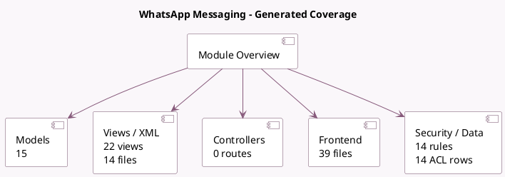

<!-- GENERATED:MODULE -->
---
tags: [odoo, enterprise, module]
---

# WhatsApp Messaging

- Scope: Enterprise Addons
- Source: enterprise/whatsapp
- Dependencies: [[docs/Community Addons/mail/mail|mail]], [[docs/Community Addons/phone_validation/phone_validation|phone_validation]]

## Summary

Text your Contacts on WhatsApp

## Generated coverage

- Models: 15
- XML files with UI/data artifacts: 14
- Views: 22
- Actions: 5
- Menus: 5
- Rules (ir.rule): 14
- Access CSV entries: 14
- Controller units: 0
- Frontend asset files: 39

## Module map

## Detail notes

- Models: [[docs/Enterprise Addons/whatsapp/Models|Models]] (15)
- Views and XML: [[docs/Enterprise Addons/whatsapp/Views|Views]] (14 files)
- Frontend: [[docs/Enterprise Addons/whatsapp/Frontend|Frontend]] (39 files)

## Key models

- `base`
- `discuss.channel`
- `discuss.channel.member`
- `ir.actions.server`
- `mail.message`
- `mail.thread`
- `res.partner`
- `res.users.settings`
- `whatsapp.account`
- `whatsapp.composer`
- `whatsapp.message`
- `whatsapp.preview`

## Navigation

- [[../Enterprise Addons/Enterprise Addons|Back to scope]]
- [[../../docs/docs|Back to docs]]

<!-- GENERATED:MODULE -->

