<!-- GENERATED:MODEL -->
---
tags: [odoo, enterprise, generated, model]
---

# account_followup.manual_reminder

- Module: [[docs/Enterprise Addons/whatsapp_account_followup/whatsapp_account_followup|whatsapp_account_followup]]
- Scope: Enterprise Addons
- Defined in module: yes
- Source files: `wizard/followup_manual_reminder.py`
- Python classes: `Account_FollowupManual_Reminder`
- Inherits: `whatsapp.composer`

## Field footprint

- Detected fields: 2
- Field types: `Boolean` x 1, `Many2one` x 1
- Relation fields: 1

## Sample fields

- `attachment_id`: `Many2one` (comodel `ir.attachment`)
- `whatsapp`: `Boolean`

## Method hints

- Detected methods: 4
- Action methods: none
- Compute methods: `_compute_number`, `_compute_show_send_button`
- Onchange methods: none

## Direct relation diagram

```plantuml
@startuml
!define ODOO_COLOR_PRIMARY #714B67
!define ODOO_COLOR_ACCENT #875A7B
!define ODOO_COLOR_BG #FAF7FA

skinparam backgroundColor ODOO_COLOR_BG
skinparam defaultTextAlignment left
skinparam ArrowColor ODOO_COLOR_ACCENT
skinparam ClassBackgroundColor white
skinparam ClassBorderColor ODOO_COLOR_PRIMARY
skinparam ComponentBackgroundColor white
skinparam ComponentBorderColor ODOO_COLOR_PRIMARY
skinparam NoteBackgroundColor #FFF8FF
skinparam NoteBorderColor ODOO_COLOR_ACCENT
skinparam SequenceLifeLineBorderColor ODOO_COLOR_ACCENT
skinparam SequenceLifeLineBackgroundColor #FFFFFF
skinparam SequenceParticipantBorderColor ODOO_COLOR_PRIMARY
skinparam SequenceParticipantBackgroundColor #FFFFFF
skinparam sequence {
  ArrowColor ODOO_COLOR_ACCENT
  ActorBorderColor ODOO_COLOR_PRIMARY
}
title account_followup.manual_reminder - Direct Relations
class "account_followup.manual_reminder" as account_followup_manual_reminder
class "ir.attachment" as ir_attachment
account_followup_manual_reminder --> ir_attachment : attachment_id
@enduml
```

## Navigation

- **Parent:** [[docs/Enterprise Addons/whatsapp_account_followup/Models]]

<!-- GENERATED:MODEL -->
