<!-- GENERATED:MODEL -->
---
tags: [odoo, enterprise, generated, model]
---

# calendar.alarm

- Module: [[docs/Enterprise Addons/whatsapp_calendar/whatsapp_calendar|whatsapp_calendar]]
- Scope: Enterprise Addons
- Defined in module: extension only
- Source files: `models/calendar_alarm.py`
- Python classes: `CalendarAlarm`

## Field footprint

- Detected fields: 2
- Field types: `Many2one` x 1, `Selection` x 1
- Relation fields: 1

## Sample fields

- `alarm_type`: `Selection`
- `wa_template_id`: `Many2one` (comodel `whatsapp.template`, compute `_compute_wa_template_id`, store `True`)

## Method hints

- Detected methods: 1
- Action methods: none
- Compute methods: `_compute_wa_template_id`
- Onchange methods: none

## Direct relation diagram

```plantuml
@startuml
!define ODOO_COLOR_PRIMARY #714B67
!define ODOO_COLOR_ACCENT #875A7B
!define ODOO_COLOR_BG #FAF7FA

skinparam backgroundColor ODOO_COLOR_BG
skinparam defaultTextAlignment left
skinparam ArrowColor ODOO_COLOR_ACCENT
skinparam ClassBackgroundColor white
skinparam ClassBorderColor ODOO_COLOR_PRIMARY
skinparam ComponentBackgroundColor white
skinparam ComponentBorderColor ODOO_COLOR_PRIMARY
skinparam NoteBackgroundColor #FFF8FF
skinparam NoteBorderColor ODOO_COLOR_ACCENT
skinparam SequenceLifeLineBorderColor ODOO_COLOR_ACCENT
skinparam SequenceLifeLineBackgroundColor #FFFFFF
skinparam SequenceParticipantBorderColor ODOO_COLOR_PRIMARY
skinparam SequenceParticipantBackgroundColor #FFFFFF
skinparam sequence {
  ArrowColor ODOO_COLOR_ACCENT
  ActorBorderColor ODOO_COLOR_PRIMARY
}
title calendar.alarm - Direct Relations
class "calendar.alarm" as calendar_alarm
class "whatsapp.template" as whatsapp_template
calendar_alarm --> whatsapp_template : wa_template_id
@enduml
```

## Navigation

- **Parent:** [[docs/Enterprise Addons/whatsapp_calendar/Models]]

<!-- GENERATED:MODEL -->
