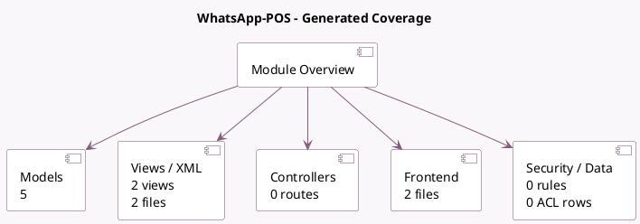

<!-- GENERATED:MODULE -->
---
tags: [odoo, enterprise, module]
---

# WhatsApp-POS

- Scope: Enterprise Addons
- Source: enterprise/whatsapp_pos
- Dependencies: [[docs/Community Addons/point_of_sale/point_of_sale|point_of_sale]], [[docs/Enterprise Addons/whatsapp/whatsapp|whatsapp]]

## Generated coverage

- Models: 5
- XML files with UI/data artifacts: 2
- Views: 2
- Actions: 0
- Menus: 0
- Rules (ir.rule): 0
- Access CSV entries: 0
- Controller units: 0
- Frontend asset files: 2

## Module map

## Detail notes

- Models: [[docs/Enterprise Addons/whatsapp_pos/Models|Models]] (5)
- Views and XML: [[docs/Enterprise Addons/whatsapp_pos/Views|Views]] (2 files)
- Frontend: [[docs/Enterprise Addons/whatsapp_pos/Frontend|Frontend]] (2 files)

## Key models

- `pos.config`
- `pos.order`
- `res.config.settings`
- `whatsapp.composer`
- `whatsapp.template`

## Navigation

- [[../Enterprise Addons/Enterprise Addons|Back to scope]]
- [[../../docs/docs|Back to docs]]

<!-- GENERATED:MODULE -->

