<!-- GENERATED:MODEL -->
---
tags: [odoo, enterprise, generated, model]
---

# sign.request

- Module: [[docs/Enterprise Addons/whatsapp_sign/whatsapp_sign|whatsapp_sign]]
- Scope: Enterprise Addons
- Defined in module: extension only
- Source files: `models/sign_request.py`
- Python classes: `SignRequest`

## Field footprint

- Detected fields: 5
- Field types: `Char` x 3, `Many2one` x 1, `Selection` x 1
- Relation fields: 1

## Sample fields

- `raw_optional_message`: `Char` (compute `_compute_raw_optional_message`)
- `refusal_reason`: `Char`
- `refuser_partner`: `Many2one` (comodel `res.partner`, compute `_compute_refuser_partner`)
- `send_channel`: `Selection`
- `signers_name`: `Char` (compute `_compute_signers_name`)

## Method hints

- Detected methods: 6
- Action methods: none
- Compute methods: `_compute_raw_optional_message`, `_compute_refuser_partner`, `_compute_signers_name`
- Onchange methods: none

## Direct relation diagram

```plantuml
@startuml
!define ODOO_COLOR_PRIMARY #714B67
!define ODOO_COLOR_ACCENT #875A7B
!define ODOO_COLOR_BG #FAF7FA

skinparam backgroundColor ODOO_COLOR_BG
skinparam defaultTextAlignment left
skinparam ArrowColor ODOO_COLOR_ACCENT
skinparam ClassBackgroundColor white
skinparam ClassBorderColor ODOO_COLOR_PRIMARY
skinparam ComponentBackgroundColor white
skinparam ComponentBorderColor ODOO_COLOR_PRIMARY
skinparam NoteBackgroundColor #FFF8FF
skinparam NoteBorderColor ODOO_COLOR_ACCENT
skinparam SequenceLifeLineBorderColor ODOO_COLOR_ACCENT
skinparam SequenceLifeLineBackgroundColor #FFFFFF
skinparam SequenceParticipantBorderColor ODOO_COLOR_PRIMARY
skinparam SequenceParticipantBackgroundColor #FFFFFF
skinparam sequence {
  ArrowColor ODOO_COLOR_ACCENT
  ActorBorderColor ODOO_COLOR_PRIMARY
}
title sign.request - Direct Relations
class "sign.request" as sign_request
class "res.partner" as res_partner
sign_request --> res_partner : refuser_partner
@enduml
```

## Navigation

- **Parent:** [[docs/Enterprise Addons/whatsapp_sign/Models]]

<!-- GENERATED:MODEL -->
