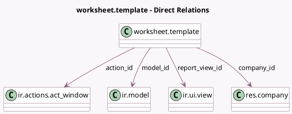

<!-- GENERATED:MODEL -->
---
tags: [odoo, enterprise, generated, model]
---

# worksheet.template

- Module: [[docs/Enterprise Addons/worksheet/worksheet|worksheet]]
- Scope: Enterprise Addons
- Defined in module: yes
- Source files: `models/worksheet_template.py`
- Python classes: `WorksheetTemplate`
- Description: Worksheet Template

## Field footprint

- Detected fields: 9
- Field types: `Boolean` x 1, `Char` x 2, `Integer` x 2, `Many2one` x 4
- Relation fields: 4

## Sample fields

- `action_id`: `Many2one` (comodel `ir.actions.act_window`)
- `active`: `Boolean`
- `company_id`: `Many2one` (comodel `res.company`)
- `model_id`: `Many2one` (comodel `ir.model`)
- `name`: `Char`
- `report_view_id`: `Many2one` (comodel `ir.ui.view`)
- `res_model`: `Char` (comodel `Host Model`)
- `sequence`: `Integer`
- `worksheet_count`: `Integer` (compute `_compute_worksheet_count`)

## Method hints

- Detected methods: 22
- Action methods: `action_analysis_report`, `action_view_worksheets`
- Compute methods: `_compute_worksheet_count`
- Onchange methods: none

## Direct relation diagram

## Navigation

- **Parent:** [[docs/Enterprise Addons/worksheet/Models]]

<!-- GENERATED:MODEL -->
