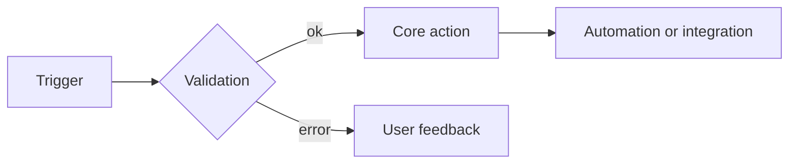

# Diagram Examples

## Purpose
Quick-copy snippets for notes that need diagrams without rebuilding the same boilerplate.

## PlantUML class diagram

```plantuml
@startuml
!include DiagramStyles.puml
title Module relations
class "sale.order" as sale_order
class "res.partner" as res_partner
class "account.move" as account_move
sale_order --> res_partner : many2one partner_id
sale_order --> account_move : one2many invoice_ids
@enduml
```

## PlantUML sequence diagram

```plantuml
@startuml
!include DiagramStyles.puml
title EDI export flow
actor User
participant "account.move" as move
participant "account.edi.document" as edi
database Attachment
User -> move: post()
move -> edi: _post()
edi -> Attachment: create XML/PDF payload
Attachment --> edi: stored document
edi --> User: status update
@enduml
```

## Mermaid flowchart



## Cross-link examples
- Scope note: `[[docs/Community Addons/Community Addons]]`
- Canonical module note: `[[docs/Community Addons/account_edi/account_edi|account_edi]]`
- Related core topic: `[[docs/Core/Infrastructure/ORM]]`
- Related process note: `[[templates/Business Process Template]]`

## Reuse rules
- Replace labels with technical names when documenting models or modules.
- Keep one diagram per concern: model relations, runtime flow, or business process.
- If a generated note needs a diagram explanation, place the narrative outside the generated block.
